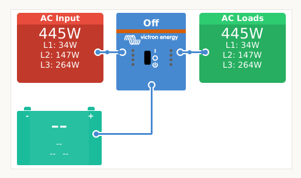
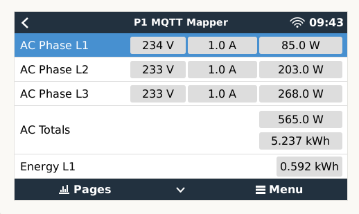
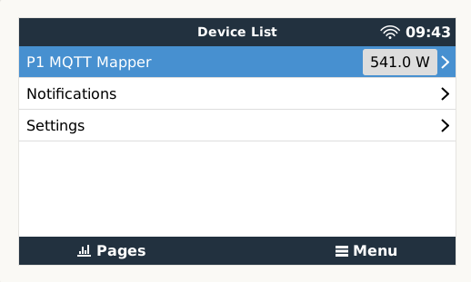

# Victron dbus MQTT Mapper

This mapper takes a json message from the source MQTT broker and reformats the values to be published to Victron VenusOS device.

On the Venus device this message gets converted to a device using the [dbus-mqtt-services](https://github.com/sebdehne/dbus-mqtt-services) script.

## Features

- Flexible JSON-based field mapping from any MQTT source to Victron D-Bus format
- Automatic timeout detection and graceful handling when source stops sending messages
- Configurable via environment variables
- Connection state monitoring for both source and Victron brokers
- Automatic reconnection and resumption when messages are restored
- Will messages for status tracking on both MQTT brokers

## Usage
The script can be executed using Python and Docker.

### Configuration

Configure the mapper using environment variables:

| Variable | Default | Description |
|----------|---------|-------------|
| `SOURCE_MQTT_BROKER` | `192.168.3.10` | IP address or hostname of the source MQTT broker |
| `VICTRON_BROKER` | `192.168.3.77` | IP address or hostname of the Victron VenusOS MQTT broker |
| `MQTT_TOPIC` | `/energy/meter` | MQTT topic to subscribe to for source messages |
| `VICTRON_TOPIC` | `/dbus-mqtt-services` | MQTT topic to publish Victron-formatted messages to |
| `WILL_TOPIC` | `/energy/status_dbus_mapper` | MQTT topic for mapper status messages |
| `MESSAGE_TIMEOUT` | `30` | Timeout in seconds - suspends publishing to Victron if no source messages received |
| `LOG_LEVEL` | `INFO` | Set to `DEBUG` for verbose logging |
| `DEBUG_LOG_MAPPING` | `False` | Set to `true` to log detailed field mapping information |

### Timeout Behavior

The mapper monitors incoming messages from the source broker. If no messages are received for `MESSAGE_TIMEOUT` seconds (default: 30), the mapper will:
1. Send a disconnected status (`/Connected = 0`) to the Victron broker
2. Suspend publishing to prevent stale data
3. Continue monitoring for new messages

When messages resume, the mapper automatically:
1. Resumes publishing to the Victron broker
2. Sends connected status (`/Connected = 1`)
3. Continues normal operation

### Start script using Python
1. Install dependencies: `pip install paho-mqtt`
2. Configure environment variables (optional):
   ```bash
   export SOURCE_MQTT_BROKER=192.168.3.10
   export VICTRON_BROKER=192.168.3.77
   export MESSAGE_TIMEOUT=30
   ```
3. Start the script: `python3 dbus_mapper.py`

### Start script using Docker
1. Ensure you have Docker installed: https://docs.docker.com/get-docker/
2. Build container: `docker build -t victron-mqtt-mapper .`
3. Start container with environment variables:
   ```bash
   docker run --name victron-mqtt-mapper -d \
     -e SOURCE_MQTT_BROKER=192.168.3.10 \
     -e VICTRON_BROKER=192.168.3.77 \
     -e MESSAGE_TIMEOUT=30 \
     victron-mqtt-mapper
   ```

## Mapping

Mapping is done using the mapper.json file.

### mapper.json header
This file has the header in the device section:
```
{
    "device": {
        "service": "p1_grid_1",
        "serviceType": "grid",
        "serviceInstance": 0,
        "dbus_data": [
            {
                "path": "/Mgmt/ProcessName",
                "value": "P1 Bridge",
                "valueType": "string",
                "writeable": false
            },
            {
                "path": "/Mgmt/ProcessVersion",
                "value": "1.0",
                "valueType": "string",
                "writeable": false
            },
            {
                "path": "/Mgmt/Connection",
                "value": "MQTT P1",
                "valueType": "string",
                "writeable": false
            },
            {
                "path": "/ProductId",
                "value": "45069",
                "valueType": "integer",
                "writeable": false
            },
            {
                "path": "/ProductName",
                "value": "P1 Energy Meter",
                "valueType": "string",
                "writeable": false
            },
            {
                "path": "/FirmwareVersion",
                "value": "1.0",
                "valueType": "string",
                "writeable": false
            },
            {
                "path": "/HardwareVersion",
                "value": "1.0",
                "valueType": "string",
                "writeable": false
            },
            {
                "path": "/CustomName",
                "value": "P1 MQTT Mapper",
                "valueType": "string",
                "writeable": true
            }
```

### mapper.json mapping fields

The fields to be mapped from the source message are in the dbus_fields section.
This way, MQTT data from existing devices can easily be mapped to a Victron device.
* name :  field in the source
* path : the path on the dbus the value is posted to
* valueTtype : the valueType used
* unit: optional  unit displayed on the Victron UI
* multiplier: optional multiplier for the value (e.g. 0.001 to divide by 1000 to go from W to kW)
(note: the description is not relevant for the working)

```

    },
    "dbus_fields": [
        {
            "name": "PowerSumActual",
            "unit": "W",
            "valueType": "float",
            "description": "Actual electricity power imported - power exported in 1 Watt resolution",
            "path": "/Ac/Power"
        },
        {
            "name": "electricityImportedToday",
            "unit": "kWh",
            "valueType": "float",
            "description": "Actual electricity power delivered (+P) in 1 Watt resolution",
            "path": "/Ac/Energy/Forward",
            "multiplier": 0.001,
            "digits": 3
        },
    ]}
```


## Screenshot of result

 


